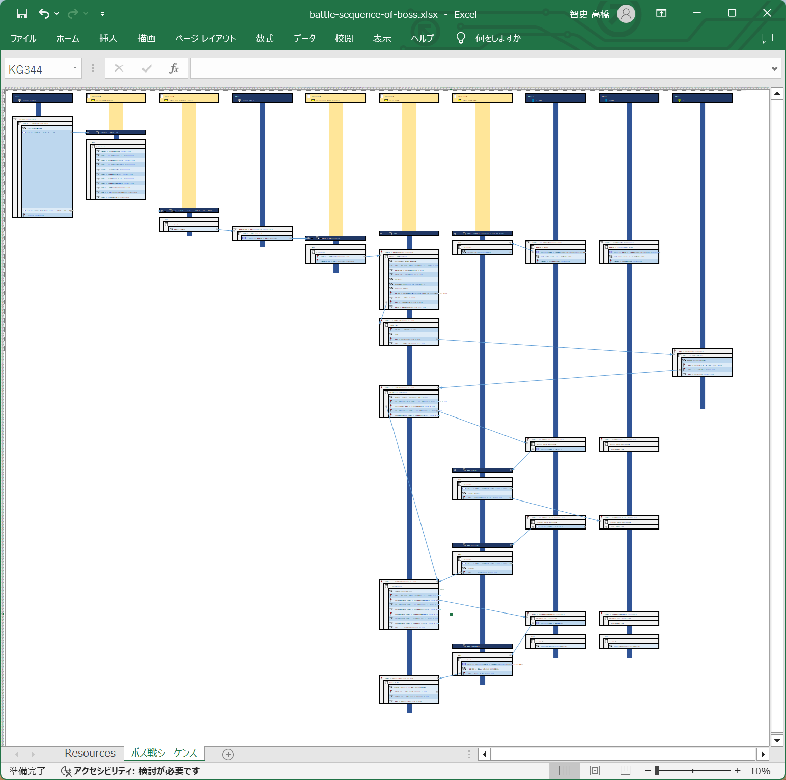

# RPG制作ツール Bakin の研究

わたしが開発中のゲーム作品［アンフェアーコイントス］を用いた、RPG制作ツール［Bakin］の研究  

# 目次

* RPG制作ツール Bakin
    * 📁ベストプラクティス - 読み物。Bakinには様々な開発スタイルがあるうち、どのようなスタイルを身に着けるのがいいかの所見を含めた解説集
        * 📄 [＜第１回＞　ワーキング・アローン](./best-practice/working_alone.md)
        * 📖 [＜第２回＞　書いたプログラムが変わってる](./best-practice/the_program_I_put_together_has_changed.md)
        * 📖 [＜第３回＞　フラグ管理の章＜その１＞](./best-practice/structure_of_flag.md)
    * 📁ただの調査報告
        * 🖼 [シーケンス図（推測したもの）](./reports/sequence-diagrams/[20241123-1525]main_loop_for_game_objects.png)
        * 📄 [変数の構造](./reports/structure_of_variables.md) - `数値` や `文字列`、 `ローカル` や `配列`、 `イベントスイッチ` などについて
        * 📄 [ゲームオブジェクトのステートの構造](./reports/structure_of_state_of_game_object.md) - `通常のイベントシート` や `P:`、 `並「列」して実行` などについて
        * 📄 [マップ・エディターでのマウス・ジェスチャー](./reports/mouse_gesture_on_map_editor.md) - 視点を `垂直上昇` させるにはどうすればいいのかとか
        * 📄 [ゲームオブジェクトの制御](./reports/control_of_game_object.md) - `自動的に開始（１回だけ実行）` とは何かとか
* ゲーム作品 アンフェアー・コイントス
    * 📁 [開発記録](./unfair-cointoss-development-records/)
        * 📄 [雑魚出現マップでの戦闘入出シーケンス](./unfair-cointoss-development-records/battle-entry-exit-sequence-on-zakosen-map)
        * 📄 [ボス戦シーケンス](./unfair-cointoss-development-records/battle-sequence-of-boss.md)

# その他の取組み

  

👆　見やすいシーケンス図の形式を考案中  
