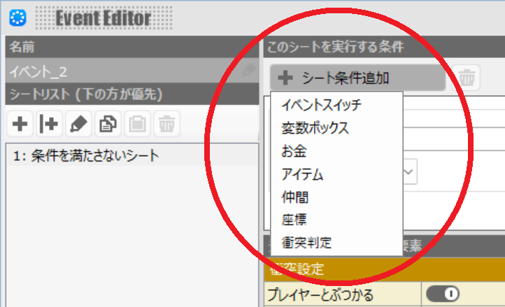
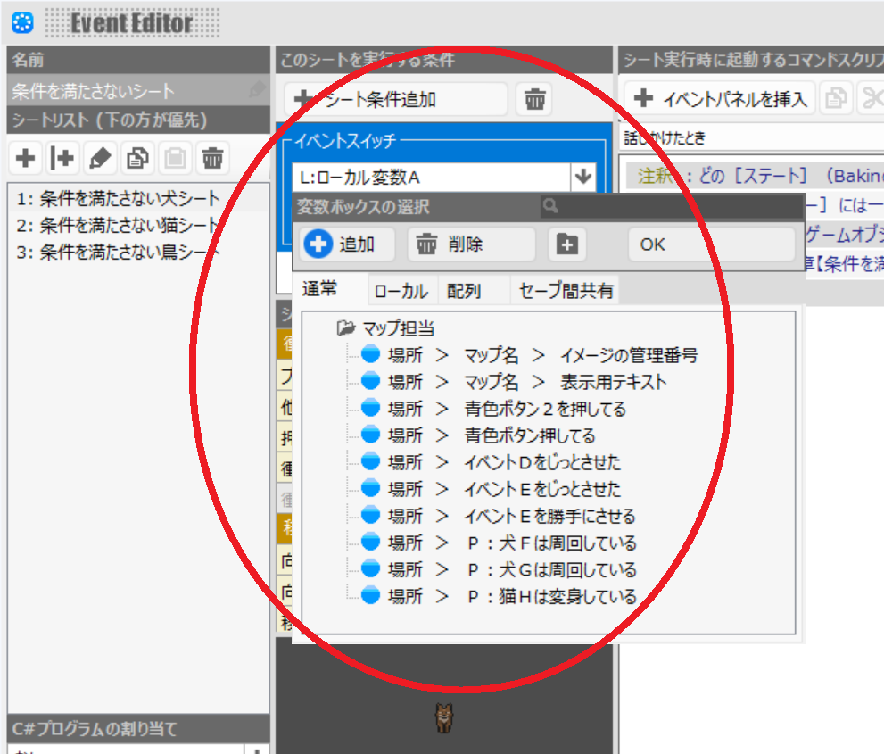

# ベスト・プラクティス＜第３回＞　フラグ管理の章＜その１＞

**フラグ管理** は、かなり膨大な話しなので、何回かすると思う。  
あとで、記事を切り貼りして、まとめ直すかもしれない。  

## ［イベントスイッチ］は［オンとオフの２状態を持つことができるもの］ぐらいの意味しかない

Bakin には［イベントスイッチ］というものがある。  
［ゲームオブジェクト］（Bakinが言う［イベント］）をスイッチしそうな名前をしている。  

しかし、Bakin にあるのは［ゲームオブジェクト］をスイッチする機構ではなく、  
［ゲームオブジェクトのステート］（Bakinが言う［イベントシート］）をスイッチする機構だ。  

もうこれだけで、せめて［イベントスイッチ］ではなくて［イベントシートスイッチ］という名前にしてほしかったが、  
問題は全く違うところにある。物の名称が実体を表していない程度の話しだけでは済まない。  

本当に［イベントシート］をスイッチするのは［シート条件］であって、  
［イベントスイッチ］は［シート条件］の１つに過ぎない。  

  

何なんだ。じゃあ、［イベントスイッチ］と名前の付いたそれは何なのか？  
ここでややこしいのは、  

  

👆　［シート条件］に使えるのは、［バリアブルズ］（変数；Variables）全般だ。  
Bakin はダッグタイピングなので、［イベントスイッチ］として使える［バリアブルズ］は全部［イベントスイッチ］だ。  

［イベントスイッチ］の要件は、その値が［オン］か［オフ］の２状態として取得できるか、に過ぎない。  

なるほど、理屈は通っている。しかし、いくらダックタイピングといえど、本当のダッグタイピングはもっと使いやすいだろう。Bakin のこの使いづらさは何なのだろうか？  

言葉としてのスイッチとは、［ＡをＢに丸ごと差し替える］ぐらいの意味だ。  
装置としてのスイッチは、 Bakin が用いるように確かに［オンとオフの２状態があるもの］だ。  
Ｃ言語の switch 文は、［Ａ、Ｂ、Ｃ・・・、またはそれ以外から、１つ、またはいくつかを選ぶ］ものだ。  

スイッチであることに間違いはないようだ。  
じゃあ、何のスイッチかが問題か？  

Bakin のそれは［オンオフスイッチ］であって、［イベントスイッチ］ではないし、［イベントシートスイッチ］でもないのではないか？  
［オン］、［オフ］をスイッチしている。それ以外の何物でもない。  
［イベント］をスイッチするという名を持つほど、イベントや、イベントシートのスイッチを代表していない。  

わたしの中では、Bakin を使うのに、まず Bakin 語を日本語に翻訳することが必要な状態だ。  
これからは［スイッチャブル・オン／オフ］（Bakinの言う［イベントスイッチ］）、  
もう少し日本語に寄せて［オンオフスイッチ］（Bakinの言う［イベントスイッチ］）、  
いや単に［フラグ］（Bakinの言う［イベントスイッチ］）とでも読み替えることにする。  

# ［マップ・エディター］は、［シナリオ・エディター］ではなく、［ゲームオブジェクト・エディター］だ

で、結局、［オンオフスイッチ］どころの話しではない。  

Bakinの言う［イベントスイッチ］が［オンオフスイッチ］であることに納得したとしても、  
［オンオフスイッチ］は［シート条件］の１つでしかない。  

シナリオライターが本当に管理すべきものは［フラグ］だが、
バキナーが管理することになる実体は、［シート条件］すべてだ。  
これは［フラグ］管理というより、単に［コンディション］（条件；Condition）管理だ。  

ロールプレイングゲームや、ノベルゲームにおいて、よく問題にされる、やらなくてはいけないものは  
［フラグ］管理だが、  
Bakin の［イベントエディター］に付いている［シート条件］は、  
［コンディション］管理をしている。  

Bakin の方が１段階、自由度の高い操作を提供している。  
恐らく、
わたしが期待したのは［シナリオ・エディター］だったが、  
Bakin が提供しているのは［ゲームオブジェクト・エディター］だからだ。  

逆に言うと、 Bakin は１段階、抽象度の高い［シナリオ・エディター］を提供できていない。  

［コンディション管理］をしている間はまだ、［フラグ管理］よりも広大なものを相手にしている。  
なるべくゲームプログラマーは［コンディション管理］ではなく［フラグ管理］ができるような構造を手に入れなければ、  
あとでデバッグが大変になる。  

結局、自力で［ゲームオブジェクト・エディター］を、［シナリオ・エディター］のように使うよう、  
自由度の高い状態に、自分縛りを入れて、自由度を低くしていく、  
そのような態度が必要になってくるし、このバッドノウハウは、仕方なく、ベストプラクティスにもなっていく。  

## 目指すべきは、状態遷移図とシーケンス図

ゲームプログラマーは［オンオフスイッチ］をいじりたいのではなく、  
［状態遷移］の出入りと［シーケンス］の出入りをいじりたい。  

［状態遷移］と［シーケンス］の出入りをいじれるようになってから、  
さあ、ゲームプログラミングのベストプラクティスは、という話しに持っていきたいが、  
その１段階手前をまず　やらなくてはいけない。  

次はその手段に踏み込んで、また記事にしたい。  
