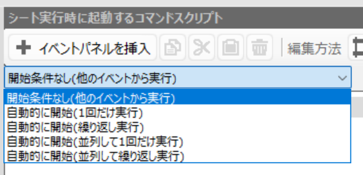
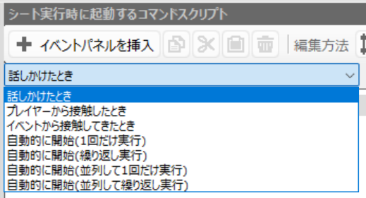
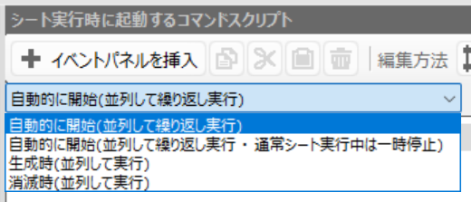

# ゲームオブジェクトの制御

## ［コモンイベント］の制御

  

Bakin での説明：  

* （Ａ）開始条件なし（他のイベントから実行）
* （Ｅ）自動的に開始（１回だけ実行）
* （Ｆ）自動的に開始（繰り返し実行）
* （Ｇ）自動的に開始（並列して１回だけ実行）
* （Ｈ）自動的に開始（並列して繰り返し実行）

👆　Bakin の言う「並列」は、一般的には［並行］  

一般的な説明：  

* （Ａ）いわゆる関数呼び出し（Function call）に近い。ただし呼び出す単位はゲームオブジェクト
* （Ｅ）マップを開き、フェードインした直後に実行されるイベントハンドラー
* （Ｆ）マップを開き、フェードインした直後に実行されるイベントハンドラー。コード全体を無限ループ文で囲ったように動く
* （Ｇ）マップを開き、暗転中に非同期に実行開始されるイベントハンドラー
* （Ｈ）マップを開き、暗転中に非同期に実行開始されるイベントハンドラー。コード全体を無限ループ文で囲ったように動く

## マップ上の［ゲームオブジェクト］（Bakin の言う［イベント］）の制御

  

Bakin での説明：  

* （Ｂ）話しかけたとき
* （Ｃ）プレイヤーから接触したとき
* （Ｄ）イベントから接触してきたとき
* （Ｅ）自動的に開始（１回だけ実行）
* （Ｆ）自動的に開始（繰り返し実行）
* （Ｇ）自動的に開始（並列して１回だけ実行）
* （Ｈ）自動的に開始（並列して繰り返し実行）

一般的な説明：  

* （Ｂ）マップ上でこのゲームオブジェクトの近傍からプレイヤーが話しかけるボタンを押下したとき
* （Ｃ）マップ上でこのゲームオブジェクトとプレイヤーのコリジョンが衝突したとき（プレイヤーの方から当たったとき）
* （Ｄ）マップ上でこのゲームオブジェクトとプレイヤーのコリジョンが衝突したとき（このゲームオブジェクトの方から当たったとき）

## マップ上の［ゲームオブジェクトのステート］（Bakin の言う［イベントシート］）の並列実行の制御

  

Bakin での説明：  

* （Ｈ）自動的に開始（並列して繰り返し実行）
* （Ｉ）自動的に開始（並列して繰り返し実行・通常シート実行中は一時停止）
* （Ｊ）生成時（並列して実行）
* （Ｋ）消滅時（並列して実行）

一般的な説明：  

* （Ｉ）※わたしにはワカラン。なんのこっちゃ
* （Ｊ）※わたしにはワカラン。なんのこっちゃ
* （Ｋ）※わたしにはワカラン。なんのこっちゃ

## その他

### ［コモンイベント］を削除すると、ゲーム中から二度と実行されなくなる？

［コモンイベント］で［自動的に開始（繰り返し実行）］する［イベントシート］を作成する。  
そしてテストプレイし、  
そのイベントシートの中で［イベント削除］コマンドを実行する。  
そして、セーブし、ロードして再開すると、［コモンイベント］は実行されない。  

### マップ上の［ゲームオブジェクト］（Bakinが言う［イベント］）を削除しても、マップに入り直せば復活する

マップ上の［ゲームオブジェクト］で［話しかけたとき］に実行される［イベントシート］を作成する。  
そしてテストプレイし、  
そのゲームオブジェクトに話しかけ、  
そのイベントシートの中で［イベント削除］コマンドを実行する。  
そのマップからそのゲームオブジェクトは消えるが、  
そのマップから出て、また入り直せば、そのゲームオブジェクトは復活している。  
