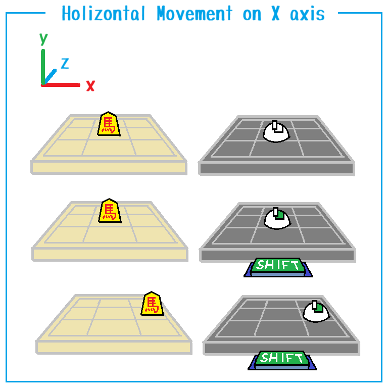

# マップ・エディターでのマウス・ジェスチャー

## Ｘ軸上を水平移動

  

## Ｙ軸上を水平移動

  

## Ｚ軸上を水平移動

  

## Ｘ軸を中心に垂直回転

  

## Ｙ軸を中心に水平回転

  

## Ｚ軸を中心に側転

無い（側転を入れるとルービックキューブみたいに難しくなるから、無いのは、まあ分かる）  

## 拡大

  

## マウスジェスチャーのための補助線

  

👆　なんか上図を見ると、  
転がすならマウス右ボタン、  
地を這（は）うならマウス中ボタン、  
垂直上昇するなら `[Alt]` キー、  
`[Shift]` は使わない、  
のが良さそうに見えるよな。  

## 他にもジェスチャーがあるが、機能が被っている

👇　以下参照  

📖 ［RPG Developer Bakin Wiki　＞　マップエディター概要　＞　①エディター画面］(https://rpgbakin.com/pukiwiki/?%E3%83%9E%E3%83%83%E3%83%97%E3%82%A8%E3%83%87%E3%82%A3%E3%82%BF%E3%83%BC%E6%A6%82%E8%A6%81#s6178986)  

## まとめ

|                   |                                | マウスを左右に移動   | マウスを前後に移動   | 何もせず   |
|------------------:|:-------------------------------|----------------------|----------------------|------------|
|                   | マウスボタンから指を放して     | カーソルを左右に移動 | カーソルを上下に移動 |            |
|                   | マウス右ボタンを押しながら     | Ｙ軸を中心に回転     | Ｘ軸を中心に回転     |            |
| `[Shift]`キーと、 | マウス右ボタンを押しながら     | Ｘ軸上を平行移動     | Ｚ軸上を平行移動     |            |
|                   | マウス中ボタンを押しながら     | Ｘ軸上を平行移動     | Ｚ軸上を平行移動     |            |
| `[Alt]`キーと、   | マウス中ボタンを押しながら     | Ｘ軸上を平行移動     | Ｙ軸上を平行移動     |            |
|                   | マウスホイールを前後に転がすと |                      |                      | 拡大／縮小 |

この操作系、覚えられん。世の中の３Ｄツールってこんな操作系なのか？　
わたしには３Ｄモデリングの知見がないのでとりあえず従うことにする。  

* 勘所
    * `[Shift]` キーは、マウス右ボタンと一緒に使う
    * マウス中ボタンをメインに使っていくんだったら、`[Shift]` は使わなくていい
    * `[Alt]` キーは、マウス中ボタンと一緒に使う。垂直上昇／下降したいときに必要
